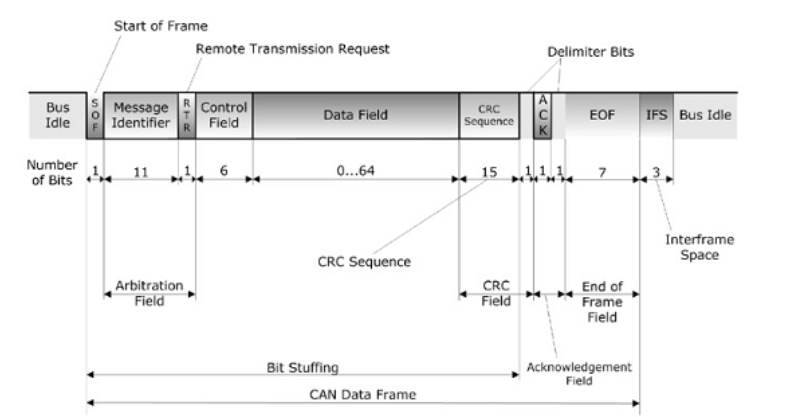
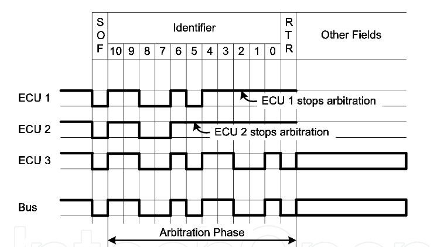

# Bus-Arbitration-Simulator

### Project Description

- This project has the goal of simulate the bus arbitration provided by CAN protocol. 
- To simulate that, it is used VHDL.

### CAN Protocol 

- First of all, it is important to understand some aspects related with CAN protocol.
- Controller Area Network(CAN) is a multi-master, message broadcast system that specifies a maximum signaling rate of 1 megabit per second(bps), a protocol that, due to its cost, performance, and upgradeability provides tremendous flexibility in system design. Because CAN is a broadcast protocol, all nodes can hear the transmission, been not possible to send a message to a specific node. But each node may react only to interesting messages. 
- CAN bus protocol was developed by BOSCH and was officially released in 1986 at the Society of Automotive Engineers (SAE) conference in Detroit, Michigan. The first CAN controller chips were introduced by Intel in 1987, and shortly thereafter by Philips. 
- If you want to know more about the CAN protocol, you can read my article: [CAN protocol](https://www.linkedin.com/pulse/can-protocol-jos%C3%A9-gomes/).

#### CAN Frame

- All CAN messages sent through the bus, have the same structure, called CAN Frame:
- **SOF:** The single dominant start of frame (SOF) bit marks the start of a message, and is used to synchronize the nodes on a bus after being idle.
- **11-bit Identifier:** The Standard CAN 11-bit identifier establishes the priority of the message. The lower the binary value, the higher its priority. 
- **RTR:** The single remote transmission request (RTR) bit is dominant when information is required from another node. All nodes receive the request, but the identifier determines the specified node. The responding data is also received by all nodes and used by any node interested. In this way, all data being used in a system is uniform.
- **IDE:** A dominant single identifier extension (IDE) bit means that a standard CAN identifier with no extension is being transmitted. 
- **r0:** Reserved bit (for possible use by future standard amendment).
- **DLC:** The 4-bit data length code (DLC) contains the number of bytes of data being transmitted.
- **Data:** Up to 64 bits of application data may be transmitted.
- **CRC:** The 16-bit (15 bits plus delimiter) cyclic redundancy check (CRC) contains the checksum (number of bits transmitted) of the preceding application data for error detection.
- **ACK:** Every node receiving an accurate message overwrites this recessive bit in the original message with a dominate bit, indicating an error-free message has been sent. Should a receiving node detect an error and leave this bit recessive, it discards the message and the sending node repeats the message after arbitration. In this way, each node acknowledges (ACK) the integrity of its data. ACK is 2 bits, one is the acknowledgment bit and the second is a delimiter. THe presence of an Acknowledgement bit on the bus does not mean that any of the intended addressees has received the message. The only thing we know is that one or more nodes on the bus has received it correctly. 
- **EOF:** This end-of-frame (EOF), 7-bit field marks the end of a CAN frame (message) and disables bit stuffing, indicating a stuffing error when dominant. When 5 bits of the same logic level occur in succession during normal operation, a bit of the opposite logic level is stuffed into the data.
- **IFS:** This 7-bit interframe space (IFS) contains the time required by the controller to move a correctly received frame to its proper position in a message buffer area. 

### Bus arbitration

- The CAN standard defines four different message types. The messages uses a clever scheme of bitwise arbitration to control access to the bus, and each message is tagged with a priority. The maximum length utility is 94 bits and they are contents-addressed.
- Arbitration is a fundamental characteristic of the can bus. As a multi-master-slave protocol, more than one node can try to access the bus. To deal with that the protocol uses a non-destructive, bit-wise arbitration. It is non-destructive because the node that wins arbitration just continues on with the message, without the message being destroyed. The allocation of priority is a feature of CAN that makes it attractive for use within a real-time control environment.
- The transmitting node constantly monitors each bit of its own transmission. The lower the message identifiers number the higher its priority, with bit zero as dominant and bit one as recessive. A dominant bit overwrites a recessive bit on the CAN bus. 
### Solution Explanation

### Results
